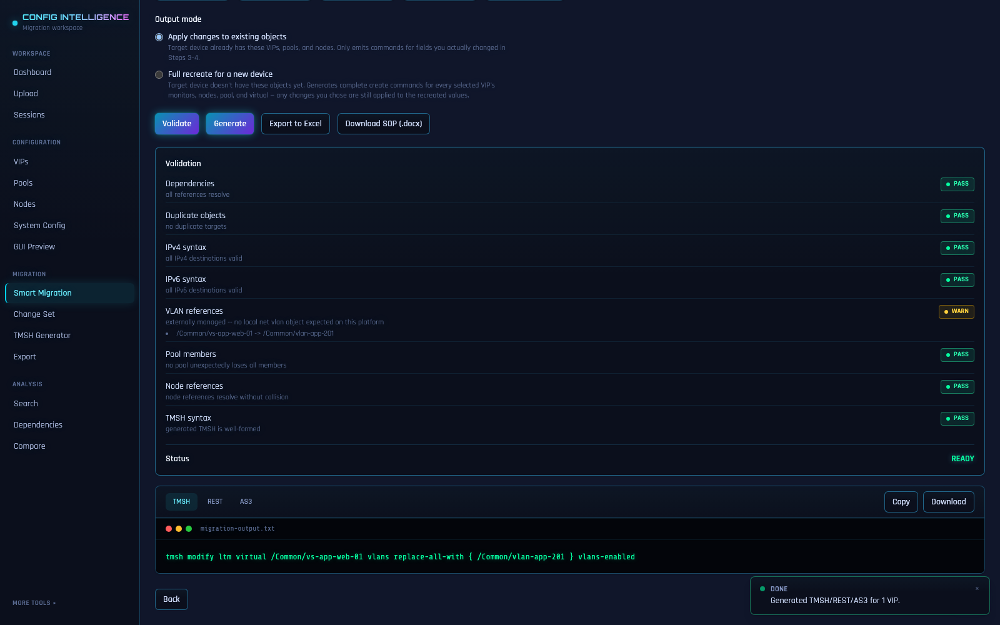
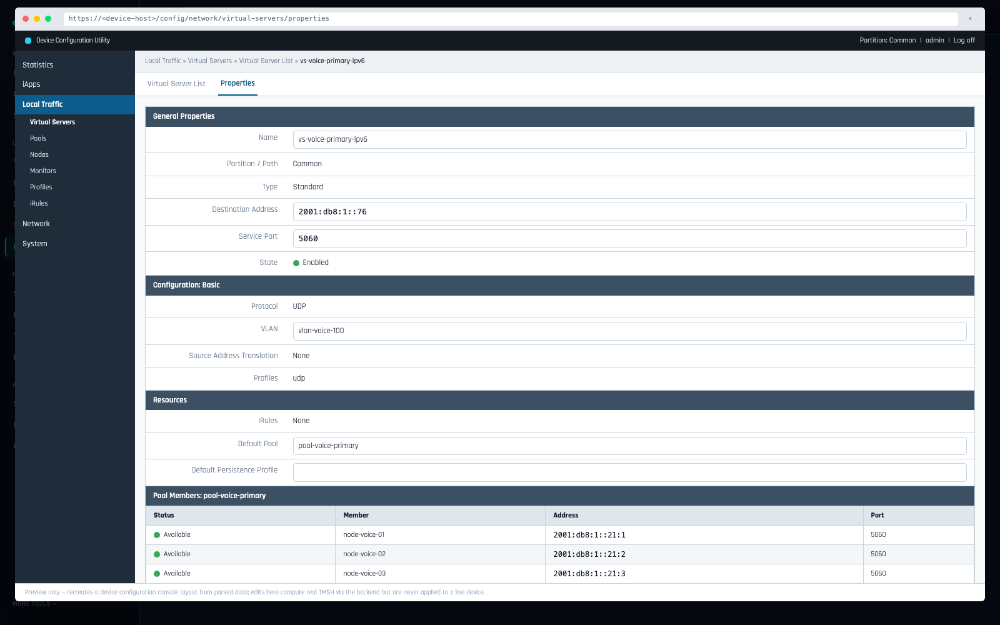
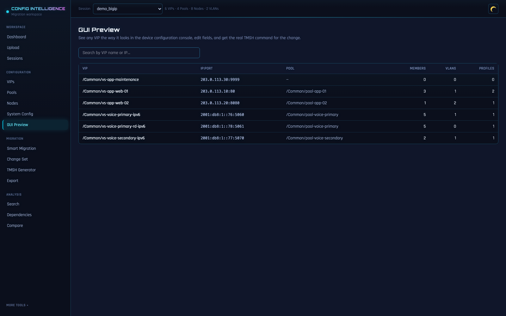
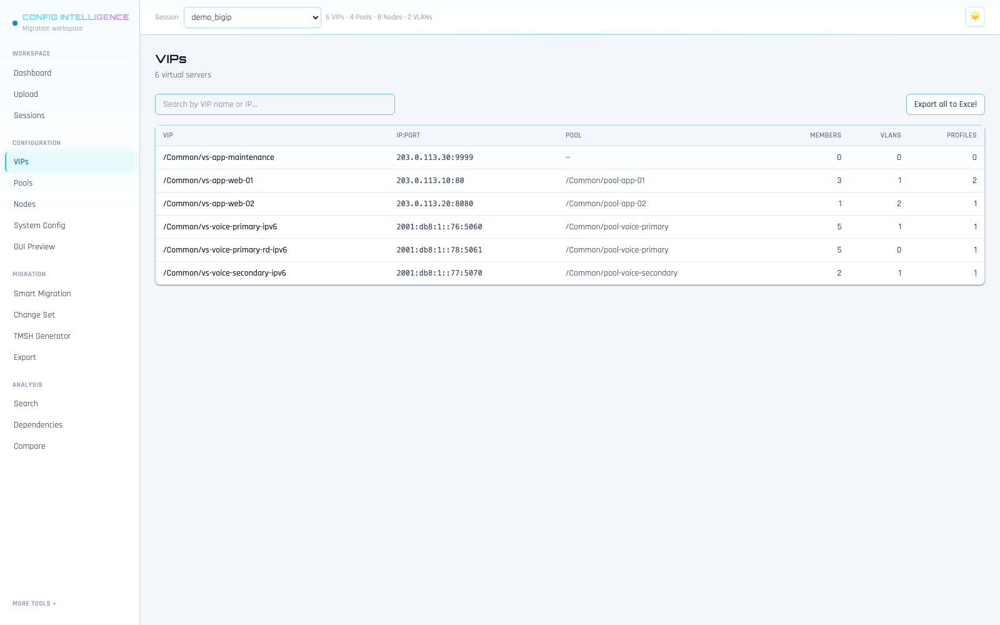

# Config Intelligence

<p align="center">
  
  
  
  
  
  
</p>

<p align="center">
  Network device configuration intelligence and bulk VIP migration — ingest a UCS/QKView/<code>bigip.conf</code>-style
  archive, plan changes across hundreds of VIPs with a dependency-aware wizard, and generate real TMSH/REST/AS3 output.
</p>

---

## What it does

- **Ingests** UCS archives, QKViews, or raw device configuration files with a real tokenizer + recursive-descent
  parser (not regex) — correctly handles IPv4/IPv6 destinations, route domains, and shared nodes/pools/VLANs.
- **Smart Migration wizard** — select VIPs, review current config, choose changes (common + per-VIP exceptions),
  and validate/generate — built so a network engineer never needs to understand the dependency graph underneath.
- **Dependency-aware change engine** — a node or pool shared by dozens of VIPs is resolved and emitted exactly
  once, in the correct order, whether you're renumbering in place or generating a full recreate script for a
  new device.
- **TMSH / REST / AS3 generation** from one shared resolved-plan representation, so the three outputs can never
  drift from each other.
- **GUI preview** — an editable recreation of a device configuration console. Change a field, and it computes
  the real TMSH command for that edit through the same backend engine the wizard uses — not a second, guessable
  formatter.
- **Excel & SOP export** — a real `.xlsx` workbook and a Word runbook (pre-migration checklist, validation
  results, numbered TMSH steps, sign-off table) generated from the same plan data.

## Screenshots

| Smart Migration — Validate & Generate | GUI Preview — editable |
|---|---|
|  |  |

| GUI Preview — Virtual Server List | Light theme |
|---|---|
|  |  |

## Run with Docker (production-style)

```bash
docker compose up --build
```

- Frontend: http://localhost:8080
- Backend API: proxied through the frontend at `/api/v1/...` (not exposed directly by default)
- Session data (uploaded archives + parsed session DBs) persists in the `cfgi-data` named volume across restarts

Override with environment variables (or a `.env` file next to `docker-compose.yml`):

| Variable | Default | Purpose |
|---|---|---|
| `FRONTEND_PORT` | `8080` | Host port the UI is served on |
| `BACKEND_WORKERS` | `4` | Gunicorn/Uvicorn worker count |
| `CFGI_CORS_ORIGINS_RAW` | `http://localhost:8080` | Comma-separated allowed CORS origins |
| `CFGI_MAX_UPLOAD_BYTES` | `536870912` (512 MB) | Upload size cap |

## Run locally for development

Backend (Python 3.9+):
```bash
cd backend
python -m venv .venv && source .venv/bin/activate
pip install -r requirements.txt
pip install -e ".[dev]"   # adds pytest
uvicorn app.main:app --reload --port 8000
```

Frontend (Node 20+):
```bash
cd frontend
npm install
npm run dev   # http://localhost:5173, proxies /api to :8000
```

## Tests

```bash
cd backend && source .venv/bin/activate && pytest       # 78 tests
cd frontend && npx tsc --noEmit
```

## Architecture

One parsed representation (`ParsedConfig`) and one resolved-plan representation (`ResolvedMigrationPlan` /
`MigrationContext`) feed every consumer — the UI, the validator, and all three generators (TMSH/REST/AS3) — so
they cannot drift from each other. See `backend/app/` module docstrings for the parser, dependency graph,
change engine, and generator design notes.

```
UCS/QKView/config archive
  → tokenizer + recursive-descent parser
  → typed domain objects (Vip, Pool, Node, Vlan, Monitor, Profile)
  → SQLite session store
  → dependency graph (networkx)
  → Smart Migration wizard → change engine (common changes ⊕ per-VIP exceptions)
  → validator (PASS / WARN / BLOCKED)
  → generators (TMSH / REST / AS3), all from one resolved plan
```

## Status

**Verified, re-confirmed as of this commit:**
- 78/78 backend tests passing
- Zero console/page errors across all 15 frontend routes, including interactive flows (GUI Preview edit,
  theme toggle)

**Known gaps — not yet built:**
- Not validated against a real production configuration export — everything above runs against a synthetic fixture
- SNAT pools (translation address pools), self-IPs, and route-domain objects aren't modeled as first-class
  objects yet (route domain *suffix* parsing on a VIP destination — the `%N` in `2001:db8::1%10` — is handled;
  a dedicated route-domain object is not)
- Docker deployment files are written but not build-tested end-to-end in this environment

Treat this as a well-tested planning/generation tool against the data it's actually been run against — not yet
a claim of production-readiness for your specific environment until the item above is closed.
